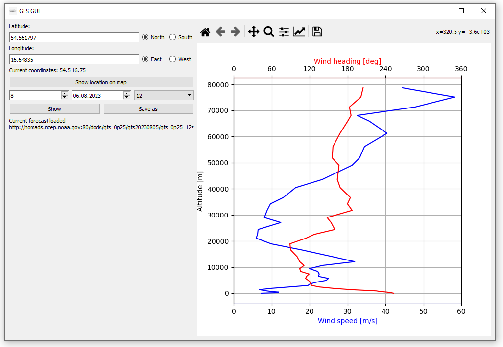

# weather_forecast_gui
Python program with GUI downloading GFS weather forecast data \
\
The program uses netCDF4 framework to download weather forecast data from GFS model. 
GUI built in PyQt5 is used to input data required to download the forecast: 
- latitude and longitude of the location 
- date of the forecast 

The forecast can be viewed in GUI and the wind profile saved to a .txt file. 

 

